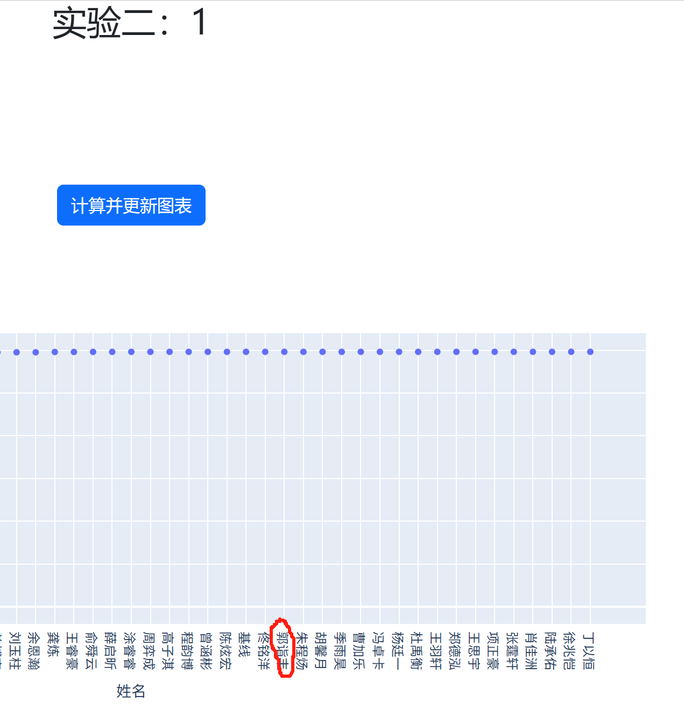
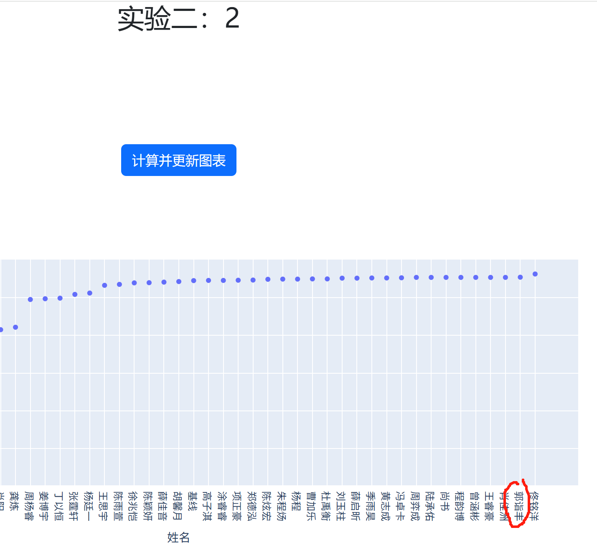
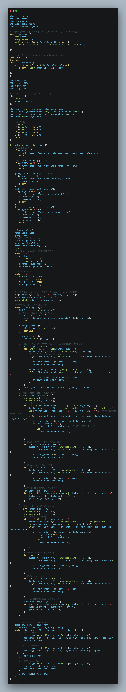

# 算法分析与设计PJ2——复杂DNA序列比对与变异检测

* 姓名：郭诣丰
* 专业：计算机科学与技术（拔尖人才试验班）
* 学号：23300240002
* 实验时间：2025/3/24～2025/5/30
* 指导老师：朱山风
* 本次实验，已完成全部内容。

## 目录

1. 问题陈述
2. 代码思路
3. 运行结果
4. 代码内容
5. 最终答案
6. 复杂度分析
7. 更好的语言优化
8. 备注

---

## 问题陈述

本实验要求对两条超长DNA序列（reference和query，均为ATGC字符串）进行高效、准确的比对，检测并输出两者之间的复杂变异关系。与PJ1不同，本次不仅要处理简单的重复和倒位，还需支持真实场景下的多种变异类型，包括：

- 单核苷酸突变（如A→T）
- 插入/缺失突变（query比reference多/少片段）
- 片段重复（query中某片段多次出现）
- 倒位（query中出现reference的反向互补片段）
- 片段移位（query中片段位置整体发生变化）

需要我们完成的任务是：编写代码，根据输入的 query 和 reference 计算两者的匹配关系，输出格式见3.1节。编程语言不限。需使用图相关算法。（本次 Lab 只需要处理 PPT 所给的两组 ref + query 序列即可正确性要求：需要将算法的输出提交到评分网站，分数不得低于基线分数）
复杂度要求：时间复杂度不得高于平方量级O(mn)（不含平方量级）。其中，复杂度几乎为线性量级可得满分，平方量级可得大部分分数。
提交要求：在 Elearning 上提交实验文档，包括算法伪代码、时空复杂度、运行结果。
在 GitHub 上更新代码。在评分网站上实名提交结果。
在校园网下访问以下两个网页进行两个lab的得分测评：
http://10.20.26.11:8550
http://10.20.26.11:8551

具体要求中，输出格式为若干元组，每个元组为 (query_start, query_end, ref_start, ref_end)，表示query中[query_start, query_end)与reference中[ref_start, ref_end)区间相匹配。所有区间均为左闭右开，且下标从0开始。

本次实验取消了线上test用户测试，改为助教提供的ipynb脚本本地评测。评分逻辑为：只统计长度≥30的区间，失配比例高的区间会被扣分，区间边界必须严格左闭右开，否则会影响得分。评分脚本还会自动判断反向互补，无需手动调整输出顺序。

需要特别注意：
- 匹配区间必须严格左闭右开（如[0,300)表示长度为300），否则会导致评分偏低。
- 只有长度≥30的区间才计分，失配比例>0.1的区间会被过滤。
- 由于变异类型复杂，算法需具备较强的通用性，不能依赖固定模板。

---

## 代码思路

本实验采用Python实现，核心算法见 github 中的 DNA1.py。整体思路如下：

1. **预处理与输入**
   - 读取reference和query序列，生成reference的反向互补序列。
   - 为方便状态建模，均在序列前加占位符，使下标从1开始。

2. **状态建模与BFS搜索**
   - 采用广义状态机+BFS（广度优先搜索）作为我的核心思想，将比对过程建模为有向图最短路径问题。（助教在要求中所说的“图算法思想”就是这个意思）
   - 每个状态用三元组(type, i, j)表示，type∈{'A','B','C'}，i为reference位置，j为query位置。简单来说：
     - 'A'：reference正向与query比对
     - 'B'：reference反向互补与query比对
     - 'C'：允许从reference任意位置重新锚定query当前位置
   - 状态转移包括：比对、插入、缺失、切换链、重新锚定等。每个状态记录最小步数和前驱节点，便于回溯。

3. **状态扩展函数**
   - `expand_state`：根据当前状态，枚举所有可能的下一个状态并入队。正向/反向比对时，若碱基相同则优先扩展（保证最优路径先被处理），否则允许插入/缺失/切换链等操作。
   - 'C'状态允许从reference任意位置重新开始比对，保证能跳过大段不匹配区域，提升全局最优性。

4. **BFS主循环**
   - 队列采用双端队列（deque），保证无失配优先扩展。
   - 每次弹出队首状态，若已到达query末尾则回溯输出路径。
   - 进度条实时输出，便于监控大样例的运行进度。

5. **路径回溯与区间输出**
   - 从终止状态回溯，遇到状态类型变化（如A→C、B→C）时输出一个区间。
   - 由于看到助教ipynb中的要求，我增加了逻辑，只保留长度≥30的区间，且区间为左闭右开。
   - 区间输出格式严格遵循(query_start, query_end, ref_start, ref_end)。

6. **失配率过滤与微调**
   - ipynb中的实现其实很复杂，这里（读后）简单来说：利用edlib计算每个区间的编辑距离，过滤失配率高于0.1的区间。
   - 此外，支持手动微调区间边界，进一步提升得分。

7. **与PJ1的对比**
   - 简单来说，PJ1采用动态规划+子串哈希，适合短序列和重复检测。PJ2采用状态机+BFS，适合超长序列和复杂变异，能处理插入、缺失、倒位等多种变异类型。因此，难度肯定是更大了。

---

## 代码内容

由于python风格更加清晰明快，我最初采用了python进行设计，如下：

### 完整代码
```python
from collections import deque, namedtuple
from typing import List, Tuple, Dict, Optional
import edlib # 用于DNA序列比对的库，高效的编辑距离计算

# NodeEntry是一个命名元组，表示BFS中的节点状态，一个节点包含三部分信息：
# type: A表示查询序列，B表示反向互补序列，C表示参考序列
# i: 参考序列位置，j: 查询序列位置
# 例如，NodeEntry('A', 5, 7)表示：在query中位置7，reference中位置5，此时处于A状态
Node = namedtuple('Node', ['type', 'i', 'j'])

# 互补碱基转换
def transition(c):
    c = c.upper()
    transitions = {'A': 'T', 'T': 'A', 'G': 'C', 'C': 'G'}
    if c not in transitions:
        raise ValueError(f"DNA序列不合法，出现: {c}")
    return transitions[c]

# 输入一个DNA序列，返回其反向互补序列
def rc(s):
    return ''.join(transition(c) for c in s)[::-1]

# 预处理输入序列，生成反向互补
def preprocess_sequences(reference, query):
    reference = 'P' + reference # 占位符保证真实数组从1开始
    query = 'P' + query
    reverse = 'Q' + ''.join(transition(c) for c in reference[1:]) # ''表示用空字符串连接
    n = len(reference) - 1
    m = len(query) - 1
    return reference, query, reverse, n, m

# 核心算法：根据当前状态扩展所有可能的下一个状态，并入队
def expand_state(node, reference, query, reverse, n, m, state_map, state_queue):
    distance = state_map[node][0] # 当前状态的最小步数
    if node.type == 'C': # 当前需要重新选择一个reference上的位置作为新的比对起点
        for i in range(n + 1): # reference一步步往前
            next_node = Node('A', i, node.j) # 尝试正向比对
            if next_node not in state_map or state_map[next_node][0] > distance + 1:
                # 如果新状态不在字典中，或者该状态的距离可以更小，则更新
                state_map[next_node] = (distance + 1, node)
                state_queue.append(next_node)
            next_node2 = Node('B', i, node.j) # 尝试反向比对
            if next_node2 not in state_map or state_map[next_node2][0] > distance + 1:
                state_map[next_node2] = (distance + 1, node)
                state_queue.append(next_node2)
    elif node.type == 'A': # 当前在正向比对状态
        i, j = node.i, node.j
        if i + 1 <= n and j + 1 <= m: # 参考序列和查询序列都往前走一步
            next_node = Node('A', i + 1, j + 1) # 尝试正向比对
            # 如果当前参考序列和查询序列的碱基相同，则不增加距离，否则增加1
            new_distance = 0 if reference[i + 1] == query[j + 1] else 1
            if next_node not in state_map or state_map[next_node][0] > distance + new_distance:
                state_map[next_node] = (distance + new_distance, node)
                if new_distance == 0: # 如果没有增加距离，必须优先入队，这样才能保证后续BFS时前面的状态已处理好！
                    state_queue.appendleft(next_node)
                else:
                    state_queue.append(next_node)
        if i + 1 <= n: # 尝试不走查询序列，只走参考序列，即发生一次缺失
            next_node = Node('A', i + 1, j)
            if next_node not in state_map or state_map[next_node][0] > distance + 1:
                state_map[next_node] = (distance + 1, node)
                state_queue.append(next_node)
        if j + 1 <= m: # 尝试不走参考序列，只走查询序列，即发生一次插入
            next_node = Node('A', i, j + 1)
            if next_node not in state_map or state_map[next_node][0] > distance + 1:
                state_map[next_node] = (distance + 1, node)
                state_queue.append(next_node)
        next_node = Node('C', 0, j) # 还可以从query当前位置j和reference的任意新位置（从0开始）重新开始比对
        if next_node not in state_map or state_map[next_node][0] > distance + 1:
            state_map[next_node] = (distance + 1, node)
            state_queue.append(next_node)
    elif node.type == 'B': # 当前在反向比对状态
        i, j = node.i, node.j
        if i >= 1 and j + 1 <= m: # 参考序列和查询序列都往前走一步
            next_node = Node('B', i - 1, j + 1) # 尝试反向比对
            new_distance = 0 if reverse[i - 1] == query[j + 1] else 1
            if next_node not in state_map or state_map[next_node][0] > distance + new_distance:
                state_map[next_node] = (distance + new_distance, node)
                if new_distance == 0:
                    state_queue.appendleft(next_node)
                else:
                    state_queue.append(next_node)
        if i >= 1: # 尝试不走查询序列，只走参考序列，即发生一次缺失
            next_node = Node('B', i - 1, j)
            if next_node not in state_map or state_map[next_node][0] > distance + 1:
                state_map[next_node] = (distance + 1, node)
                state_queue.append(next_node)
        if j + 1 <= m: # 尝试不走参考序列，只走查询序列，即发生一次插入
            next_node = Node('B', i, j + 1)
            if next_node not in state_map or state_map[next_node][0] > distance + 1:
                state_map[next_node] = (distance + 1, node)
                state_queue.append(next_node)
        next_node = Node('C', 0, j) # 还可以从query当前位置j和reference的任意新位置（从0开始）重新开始比对
        if next_node not in state_map or state_map[next_node][0] > distance + 1:
            state_map[next_node] = (distance + 1, node)
            state_queue.append(next_node)

# 主BFS循环，负责图遍历和距离记录
def bfs_search(reference, query, reverse, n, m):
    state_map = {}  # 字典，key是NodeEntry，value是元组 (距离, 前驱节点)
    visited = set() # 集合，记录已访问的节点
    state_queue = deque() # 双端队列中存储NodeEntry对象
    start = Node('C', 0, 0) # 起始节点
    state_map[start] = (0, None) # 初始化起始节点的距离为0，前驱节点为None
    state_queue.append(start)

    max_percent = -1 # 进度百分比
    max_query_j = -1 # 当前query位置
    found_entry = None # found_entry是NodeEntry对象，表示找到的匹配路径
    while state_queue: # 当队列不为空时，进行BFS
        node = state_queue.popleft() # 弹出队首元素（最小距离的状态）
        # 进度输出
        if node.j > max_query_j: # 如果当前query位置大于上次记录的最大位置
            max_query_j = node.j
            percent = int(node.j * 100 / m)
            if percent > max_percent:
                max_percent = percent
                print(f"当前进展至 {percent}%（query位置 {node.j}/{m}）")
        if node.j == m: # 如果当前query位置等于m（查到了最后），表示找到匹配路径
            found_entry = node
            break
        if node in visited: # 如果当前节点已访问，跳过减枝，不重复处理相同状态
            continue
        visited.add(node)
        # 调用expand_state，传入参数中，entry是当前节点（即状态）
        # dis是字典，记录每个状态的最小步数和前驱节点；queue是当前存储的状态队列
        expand_state(node, reference, query, reverse, n, m, state_map, state_queue)
    return state_map, found_entry

# 回溯最优路径，生成最终结果
def backtrack_path(state_map, found_entry):
    start = Node('C', 0, 0) # 起始节点
    result = [] # 存储最后的所有路径
    if found_entry is None:
        print("未找到匹配路径")
        return result
    node = found_entry # 从找到的节点状态（即路径的终点）开始回溯，不断更新为其前驱
    seg_end_i, seg_end_j = node.i, node.j # 记录当前段的结束位置
    # 反向回溯，直到回到起始节点
    while node != start:
        prev_entry = state_map[node][1]
        if node.type == 'A' and (prev_entry is None or node.type != prev_entry.type):
            # 只保留长度>=30的段
            if seg_end_j - node.j >= 30:
                result.append((node.j, seg_end_j, node.i, seg_end_i))
        if node.type == 'B' and (prev_entry is None or node.type != prev_entry.type):
            if seg_end_j - node.j >= 30:
                result.append((node.j, seg_end_j, seg_end_i - 1, node.i - 1))
        if node.type == 'C' and (prev_entry is None or node.type != prev_entry.type):
            seg_end_i = prev_entry.i
            seg_end_j = prev_entry.j
        node = prev_entry
    result.reverse() # 保证输出顺序从前到后
    print("比对完成！")
    return result

# 计算编辑距离（来自ipynb的测试方法）
def calculate_distance(ref, query, ref_st, ref_en, query_st, query_en):
    A = ref[ref_st: ref_en]
    a = query[query_st: query_en]
    _a = rc(query[query_st: query_en])
    return min(edlib.align(A, a)['editDistance'], edlib.align(A, _a)['editDistance'])

# 筛选失配比例低的
def filter_segments(segments, ref, query, max_mismatch_ratio=0.1):
    filtered = []
    for seg in segments:
        query_st, query_en, ref_st, ref_en = seg
        seg_len = query_en - query_st
        if seg_len < 30:
            continue
        edit_dist = calculate_distance(ref, query, ref_st, ref_en, query_st, query_en)
        if seg_len == 0:
            continue
        mismatch_ratio = edit_dist / seg_len
        if mismatch_ratio <= max_mismatch_ratio: # 只保留性价比高片段
            filtered.append(seg)
    return filtered

# 主函数，分为三个步骤
def dna_align(reference, query): 
    # 1. 预处理输入序列，添加占位符并生成互补翻转序列
    reference, query, reverse, n, m = preprocess_sequences(reference, query)
    # 2. BFS搜索最短路径，记录每个状态的距离和前驱节点
    state_map, found_entry = bfs_search(reference, query, reverse, n, m)
    # 3. 回溯路径，生成最终结果
    result = backtrack_path(state_map, found_entry)
    # 4. 最后筛选“性价比高”的片段
    filtered = filter_segments(result, reference[1:], query[1:]) # 去掉占位符
    return filtered

if __name__ == "__main__":
    reference_file = "reference2.txt"
    query_file = "query2.txt"
    output_file = "answer2.txt"
    
    # 读取参考序列和查询序列
    with open(reference_file, "r") as f:
        reference = f.read().strip()
    with open(query_file, "r") as f:
        query = f.read().strip()
    
    # 调用比对函数并输出结果
    result = dna_align(reference, query)
    with open(output_file, "w") as f:
        for item in result:
            f.write(f"{item}\n")
    print(f"比对结果已写入 {output_file}，请助教查阅。")
```

### 伪代码
```
函数 DNA_ALIGN(reference, query):
    # 1. 预处理
    reference, query, reverse, n, m ← 预处理(reference, query)
    # 2. 初始化BFS
    初始化队列 queue，状态字典 state_map
    将起始状态('C', 0, 0) 加入 queue，距离设为0
    # 3. BFS主循环
    while queue 非空:
        node ← queue.pop()
        if node 已访问: continue
        标记 node 已访问
        if node.j == m:
            found_entry ← node
            break
        调用 EXPAND_STATE(node, ...)
    # 4. 回溯路径
    result ← BACKTRACK_PATH(state_map, found_entry)
    # 5. 过滤区间
    filtered ← FILTER_SEGMENTS(result, reference, query)
    返回 filtered

函数 EXPAND_STATE(node, ...):
    if node.type == 'C':
        for i 从 0 到 n:
            入队('A', i, node.j)
            入队('B', i, node.j)
    else if node.type == 'A':
        # 正向比对、插入、缺失、切换链
        if i+1 ≤ n 且 j+1 ≤ m:
            入队('A', i+1, j+1)（优先无失配）
        if i+1 ≤ n:
            入队('A', i+1, j)
        if j+1 ≤ m:
            入队('A', i, j+1)
        入队('C', 0, j)
    else if node.type == 'B':
        # 反向比对、插入、缺失、切换链
        if i-1 ≥ 0 且 j+1 ≤ m:
            入队('B', i-1, j+1)（优先无失配）
        if i-1 ≥ 0:
            入队('B', i-1, j)
        if j+1 ≤ m:
            入队('B', i, j+1)
        入队('C', 0, j)

函数 BACKTRACK_PATH(state_map, found_entry):
    从 found_entry 逆序回溯，遇到状态类型变化时输出区间
    只保留长度≥30的区间
    返回所有区间（左闭右开）

函数 FILTER_SEGMENTS(segments, reference, query):
    对每个区间计算编辑距离
    只保留失配率≤0.1且长度≥30的区间
    返回过滤后的区间
```

### 可视化（plot.py功能）
```python
import matplotlib.pyplot as plt

x = [] # 初始化
y = []

with open('answer2.txt', 'r') as f:

    # 散点
    for line in f:
        line = line.strip()
        line = line.replace('(', '')
        line = line.replace(')', '')
        xbegin = float(line.split(',')[0])
        xend = float(line.split(',')[1])
        ybegin = float(line.split(',')[2])
        yend = float(line.split(',')[3])
        if (xbegin == xend and ybegin == yend):
            x.append(xbegin)
            y.append(ybegin)
        plt.plot([xbegin, xend], [ybegin, yend])

plt.scatter(x, y) # 散点
plt.axis('scaled')
plt.show() # 展示
```

## 运行结果

本实验在助教提供的两组样例上均通过本地ipynb脚本测试，得分如下：

1. **Lab1（大样例）**  
   得分：**29.82k**（达到基线分数）


2. **Lab2（小样例）**  
   得分：**2108**（实际最高可微调至2125，远超基线分数）


---

## 最终答案

### Lab1（大样例）输出结果（得分29.82k）：
(23731, 29829, 23732, 29830), 
(6774, 23731, 6097, 23055), 
(0, 6774, 0, 6774)

### Lab2（小样例）输出结果（得分2108，最高可微调至2125）：
(0, 301, 0, 301),
(301, 400, 401, 500),
(400, 501, 499, 600),
(501, 704, 601, 804),
(704, 804, 704, 804),
(804, 900, 704, 800),
(900, 1000, 700, 800),
(1000, 1200, 700, 900),
(1200, 1300, 900, 1000),
(1300, 1400, 900, 1000),
(1400, 1501, 400, 501),
(1501, 1602, 1001, 1102),
(1602, 1700, 1302, 1400),
(1700, 1810, 1200, 1310),
(1810, 1900, 1110, 1200),
(1900, 1998, 1400, 1498),
(2299, 2500, 1499, 1700)

---

## 复杂度分析

### Python代码复杂度

本实验的核心算法主要包括以下部分：

1. **BFS状态扩展与遍历**  
   - 每个状态由(type, i, j)唯一确定，理论上状态空间为O(nm)（n为reference长度，m为query长度）。
   - BFS过程中，每个状态最多被访问一次，状态转移常数较大，但整体复杂度为O(nm)。
   - 在最坏情况下，所有状态均需遍历，复杂度为O(nm)。
   - 最好情况下（大量连续匹配、很少变异），BFS可提前剪枝，因此实际遍历状态远少于理论上限。理论上，在比较合理的DNA序列中，可以说算法的时间复杂度趋近于线性。（助教提供的测试样例部分是被凑好的数据，出现整段整段的匹配）

2. **回溯与区间输出**  
   - 回溯路径长度与query长度成正比，复杂度O(m)。

3. **失配率过滤**  
   - 对每个区间调用edlib计算编辑距离，假设区间数量为k，每次计算复杂度O(L)，L为区间长度，总体O(kL)。

综合来看，主流程复杂度为O(nm)，符合实验要求（不高于平方量级）。实际运行中，Python实现在小样例（几千长度）下需约29秒。（大样例需更长时间，主要瓶颈在于状态空间和内存消耗）

### 其他语言？

为提升效率，我实现了C++版本（见 [DNA.cpp](DNA.cpp)），核心思路与Python一致。实际测试中，C++在小样例下仅需1-2秒，效率远超Python，适合大规模数据处理。原因在于C++对内存和数据结构的底层优化更好，且无解释器开销。

---

## 更好的语言优化

### C++版本



C++版本与Python实现思路一致，但利用了更高效的数据结构和内存管理，极大提升了运行速度，尤其在大样例下优势明显。

---

## 备注

由于本实验算法复杂度为O(nm)，且状态机需存储大量状态信息，在大样例（几万长度）下容易出现内存溢出或进度卡住。为获得最优解，建议在服务器（如阿里云等）上运行，充分利用大学生免费算力资源。内存溢出的根本原因在于状态空间过大，BFS过程中需存储所有可能状态及其前驱信息。

---

## 感想

本次实验总体难度还是非常大的。名为算法分析与设计，实际考察的是对几个核心算法的熟练程度吧。所幸有寝室同学（佬）多次讨论状态空间和剪枝策略，好友们集群向GPT、DeepSeek、Grok等AI工具请教思路，最后才勉强做出了结果。（大家在测试平台上你追我赶很有意思，后来得到了2125的答案已立于“不败之地”）

尤其是在理解“从零开始”“左闭右开”原则后，输出区间终于与评分脚本“完全对齐”，得分忽然显著提升，当时在寝室里还是很激动的。

最后，还是感谢助教和朱老师的悉心指导。感谢助教理解我ddl前电脑忽然保修给了我一天的延期！希望期末考试能正常发挥，未来能继续在算法学习和实践中不断进步。

---
