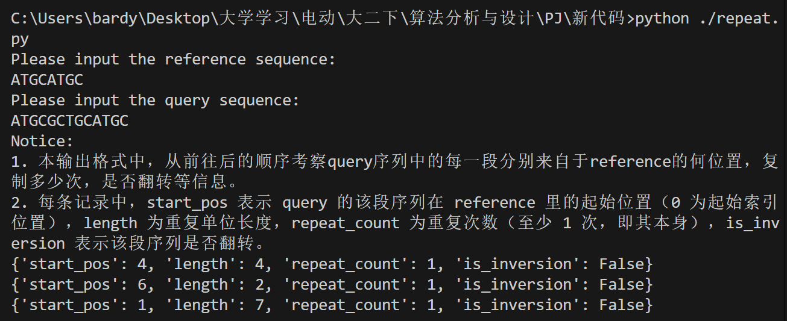
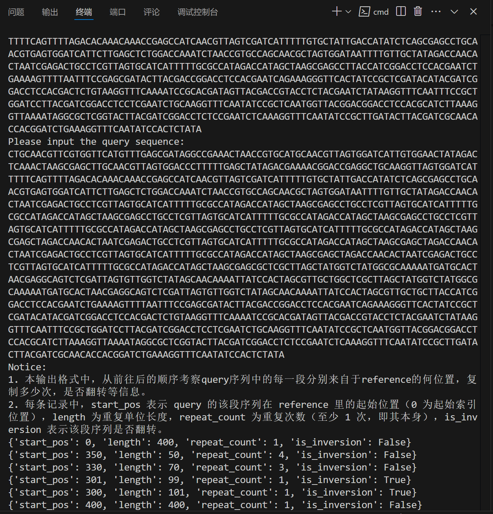
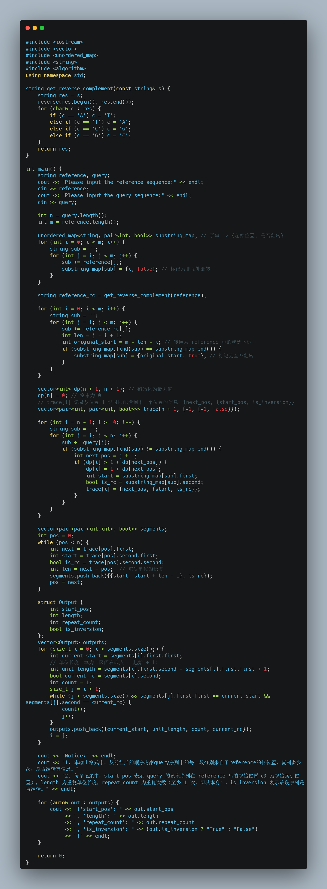
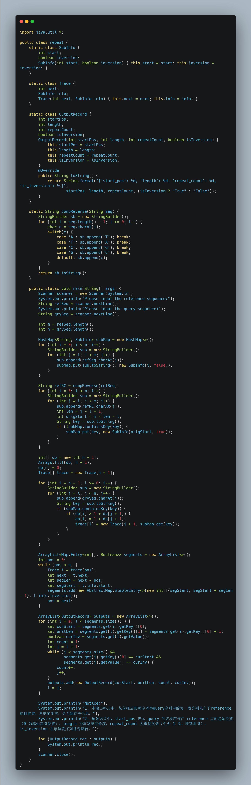

# 算法分析与设计PJ——寻找样本DNA序列中的重复片段

* 姓名：郭诣丰
* 专业：计算机科学与技术（拔尖人才试验班）
* 学号：23300240002
* 实验时间：2025/2/24～2024/3/23
* 指导老师：朱山风
* 本次实验，我完成了所有内容。

## 目录

1. 问题陈述
2. 代码思路
3. 代码内容
4. 运行结果
5. 复杂度分析
6. 更好的语言优化
7. 备注

## 问题陈述
题目要求如下：

1. 输入为两个仅包含字母 A、T、G、C 的字符串：
字符串 reference：表示“正常参考基因”，长度为 m。
字符串 query：表示“待检测患者基因”，长度为 n，其中 n > m，有可能包含多个重复片段。

2. 目标是在 query 中寻找一种连续重复出现的基因序列，该序列满足以下要求：
（1）序列必须出现在 reference 中：即这个连续的子序列（在 reference 中出现的片段）能够在原基因序列中精确匹配。
（2）序列为连续重复的片段：query 内可以将该序列视为一段连续的重复重复序列（例如 query 为 “ATATATAT”，可以分割为 “ATAT” 重复两次，而不是分解为 “AT” 重复四次）。
（3）重复次数最大化且单位长度尽可能长：若 query 中存在多种可能的重复分解，需要选择一个可以使得重复单位尽可能长的划分；此处“长”指的是重复单位的长度，同时尽量使得总分割数最少（也即每个重复单位尽可能“覆盖” query 的较大片段）。
（4）inversion 情况：考虑到可能发生序列倒位（inversion），若匹配的序列来自 reference 的互补翻转链，则输出时需要给出一个布尔值 true，表示该匹配序列是经过“互补翻转”得到的。在这种情况下，输出的起始位置应当表示 reference 上原始（正链）发生突变的位置，而并非翻转后链的位置。

3. 输出要求为一个容器（数组、列表等），其中每个元素对应一个符合条件的重复片段，每个结果包含以下形式的信息：
（1）起始位置：匹配序列在 reference 中的起始下标（基于正链，即正向序列），注意对于 inversion 的情况，此位置依然对应正链上发生变化的位置；
（2）重复序列的长度：指一个重复单元的长度；
（3）重复次数：在 query 中该重复单元连续重复的次数；
inversion 标志：布尔值，指示是否为互补翻转匹配（true 表示是互补翻转匹配，false 表示正链匹配）。

4. 此外，对于存在多个切分方法（例如可能有不同的重复单元切分方案）时，应当采用能使重复单元尽可能长、重复次数尽可能少的切分方案。也就是说，当 query 可以被不同长度的连续子串重复划分时，选择其中重复单元较长的那种方案。此切分方案必须明确指出每个重复单元在 reference 中的对应位置（需要做互补翻转映射时，则进行相应转换）。
5. 
6. 时间复杂度不高于平方量级，代码上传到GitHub。

## 代码思路

以python代码为例，我的设计实现思路如下：

1. main() 函数入口，程序首先要求用户输入两个字符串：一个作为参考序列，一个作为查询序列。这里，我要求用户严格输入大写的 “ATGC” 字符，以确保后面的互补转换不会遇到未知字符。为此定义了一个包含合法碱基的集合 valid_bases，然后利用 set() 检查输入字符串是否都在这个集合中。如果输入中存在非法字符，程序会输出错误提示，并立即返回退出。

2. 接下来便是程序的重要阶段——预处理。思路是：遍历参考序列的所有可能连续子串，并将这些子串的信息存入字典 substr_dict 中，键为子串，值为一个元组，表示该子串在参考序列中的起始位置以及是否为互补翻转产生的匹配。这里分为两部分，第一部分就是正链子串的枚举。我们用嵌套的 for 循环，从每个起始位置 i 开始，逐步扩展子串，并将每个生成的子串与当前的起始位置 i 以及标记 False（表示正链）存入字典。第二部分是构造互补翻转部分。首先调用 comp_rev 函数获得参考序列的互补翻转版本，然后同样用嵌套循环对其所有连续子串进行枚举。（comp_rev 函数类似“镜像”序列，构造一个映射字典 comp，然后利用 Python 内置的 reversed() 函数将序列倒置，最终用 "".join() 将所有转换后的字符拼接成一个新的字符串返回）

3. 预处理完成后，程序进入动态规划阶段，目的是对查询序列进行切分。我们希望把查询序列切分成多个能从参考中找到对应子串的部分，因此定义了 dp 数组，其中 dp[i] 表示从 i 到结尾最小的切分数，并设 dp[n] = 0。与此同时，还有一个 cutting 数组用来记录每个位置的切分方案，即从位置 i 切分后，下一个切分位置以及对应参考序列的匹配信息。通过倒序循环从末尾开始，在每个位置 i 逐步延伸构建子串，如果当前构造的子串能在预处理字典中找到，就比较使用该子串切分是否能使总切分数更少，如果可以，则更新 dp[i] 和 cutting[i]。这种方法类似于“最小切割”问题的动态规划，保证最后可以得到一个全局最优的切分方案。
需要注意的是，如果整个查询序列都无法与预处理映射匹配到任何子串，那么 cutting[0] 将始终为 None，此时代码会输出提示信息，让用户检查输入是否正确，然后退出。

4. 紧接着利用 cutting 数组，我们恢复出查询序列对应的每个匹配段（parts）。从查询序列的起始位置不断根据记录的信息取出每个段落，计算该段在查询序列内的长度，并对应映射到参考序列中的匹配区间。得到的每个匹配结果格式为一个元组，内部包含参考序列的起始与结束位置以及标记是否经过互补翻转。

5. 最后一步就是对这些匹配部分处理合并。这里的思路是：如果连续多个部分的匹配结果在参考序列中起始位置相同，而且翻转标志也一致，那么它们就被认为是重复出现的相同匹配单元，数量累加统计。通过 while 循环检查连续部分是否满足条件，如果满足，则将重复次数 increment，并保存合并后的结果。最后，这些结果存储为字典，其中包含 'start_pos'、'length'、'repeat_count' 以及 'is_inversion' 四个字段。
进而就可以进行输出。输出阶段，逐个输出合并后的结果字典，就完成了整个算法。

## 代码内容

由于python风格更加清晰明快，我最初采用了python进行设计，如下：

### 完整代码
```python
# comp_rev函数用于生成互补翻转序列
def comp_rev(seq):
    """
      1. 先将序列反转；
      2. 遍历反转后的序列，将每个碱基替换为其互补碱基：
         A -> T, T -> A, C -> G, G -> C.
    """
    comp = {'A': 'T', 'T': 'A', 'C': 'G', 'G': 'C'}
    # 使用reversed函数对序列进行反转，并生成互补序列
    return "".join(comp[c] for c in reversed(seq)) # 其中的"".的意思是用空字符串使之相连

def main():
    reference = input("Please input the reference sequence:\n")
    query = input("Please input the query sequence:\n")
    
    # 输入验证：确保输入的所有字符均为 A/T/G/C
    valid_bases = set("ATGC") # set()函数用于生成集合
    if not set(reference).issubset(valid_bases):
        print("reference输入含有错误碱基. 请只使用大写的 ATGC。")
        return
    if not set(query).issubset(valid_bases):
        print("query输入含有错误碱基. 请只使用大写的 ATGC。")
        return

    # 记录参考序列和查询序列的长度
    m = len(reference)
    n = len(query)
    
    # 一、预处理：构建参考序列所有连续子串的映射字典
    # 定义字典：key为子串，value为一个元组 (起始位置, 是否为互补翻转)
    # 注意：若子串在参考序列正链中出现，将记录正链信息；如果正链没有出现而互补翻转中出现，则记录互补翻转信息
    substr_dict = {}
    
    # 第一部分：正链子串枚举
    # 枚举参考序列中所有连续子串，并记录它们在正链中的起始位置
    for i in range(m): # 默认从 0 开始，一直到 m - 1
        sub = ""
        # 内层循环逐字符构造以 i 为开头的子串
        for j in range(i, m):
            sub += reference[j]
            # 保存正链信息，若该子串已存在，则覆盖无影响（因为正链本来就是优先选择的）
            substr_dict[sub] = (i, False) # 因此，如果是ATGCATGC，索引ATGC时，会找到后面的ATGC（前面的被覆盖）
    
    # 第二部分：互补翻转子串枚举
    # 先计算参考序列的互补翻转序列
    reverse = comp_rev(reference)
    # 枚举互补翻转序列的所有连续子串
    for i in range(m):
        sub = ""
        for j in range(i, m):
            sub += reverse[j]
            l = j - i + 1  # 子串长度
            # 通过公式还原正链上的起始位置（原起始位置 = m - l - i）
            orig_start = m - l - i
            # 如果该子串正链中未出现，则记录互补翻转信息
            if sub not in substr_dict:
                substr_dict[sub] = (orig_start, True)
    
    # 二、动态规划：划分查询序列，寻找最优的切分方案
    # 定义dp数组，其中dp[i]记录从查询序列下标i到末尾的最小切分数量
    # 初始化为 n+1 (一个足够大的值)，并设置dp[n] = 0（空序列需要0次切分）
    dp = [n + 1] * (n + 1)
    dp[n] = 0
    
    # cutting用于记录切分路径：cutting[i] = (下一个切分位置, (参考序列起始位置, 是否互补))
    cutting = [None] * (n + 1) # 列表，长度为 n + 1，每个元素是一个元组
    
    # 倒序遍历查询序列，从末尾向前寻找每个位置的最优切分
    for i in range(n - 1, -1, -1): # 从 n - 1 到 0
        sub = ""
        # 从位置i开始逐步构造子串，并判断是否能在参考序列中找到
        for j in range(i, n):
            sub += query[j]
            if sub in substr_dict: # 找到匹配的子串
                # 如果使用当前子串作为一个切分段能使切分总数更少，则更新dp和cutting信息
                if dp[i] > 1 + dp[j + 1]:
                    dp[i] = 1 + dp[j + 1] # 更新切分总数，使之更少
                    cutting[i] = (j + 1, substr_dict[sub]) # 更新切分路径信息
                    # 这里的j + 1是指下一个切分的位置，substr_dict[sub]则指从当前位置 i 开始，找到的最佳后继子串 sub 在参考序列中的信息
    
    # 如果没有找到匹配的切分方案，则输出错误信息并退出
    if cutting[0] is None: # 如果从 0 开始的切分元组为空
        print("Error: 无法匹配query序列中的任何子串，请检查reference和query是否正确。")
        return
    
    # 三、根据cutting数组恢复查询序列的匹配分段信息
    # parts列表用于保存每个匹配分段的信息，格式为((ref_start, ref_end), inversion)
    parts = []
    pos = 0 # 从0开始，往后找
    # 按照cutting记录从查询序列最前面逐段还原匹配结果
    while pos < n:
        nxt, (start, inv) = cutting[pos]
        seg_len = nxt - pos # 当前匹配段在查询序列中的长度
        # 对应在参考序列中的匹配区间为 [start, start + seg_len - 1]
        parts.append(((start, start + seg_len - 1), inv)) # 加入到parts列表中，为后续output做准备
        pos = nxt   # 移到下一个未匹配的位置
    
    # 四、合并连续相同的匹配段：相同的参考起始位置和翻转标志连续出现时合并为一条记录
    result = []
    i = 0
    while i < len(parts):
        # 当前段的参考序列起始位置
        cur_start = parts[i][0][0] # 即start
        # 单位长度: 当前匹配段在参考序列上的长度 (参考结束位置 - 起始位置 + 1)
        unit_len = parts[i][0][1] - parts[i][0][0] + 1 # 即seg_len
        cur_inv = parts[i][1] # 即inv
        count = 1  # 初始化重复次数为1
        j = i + 1 # j表示下一个匹配段的索引
        # 如果后续的连续匹配段与当前段匹配信息相同，则计数累加
        while j < len(parts) and parts[j][0][0] == cur_start and parts[j][1] == cur_inv:
            count += 1
            j += 1
        # 将合并后的结果保存为字典
        result.append({
            'start_pos': cur_start,
            'length': unit_len,
            'repeat_count': count,
            'is_inversion': cur_inv
        })
        i = j  # 更新索引，并跳过已合并的段
    
    # 五、输出
    print("Notice:")
    print("1. 本输出格式中，从前往后的顺序考察query序列中的每一段分别来自于reference的何位置，复制多少次，是否翻转等信息。")
    print("2. 每条记录中，start_pos 表示 query 的该段序列在 reference 里的起始位置（0 为起始索引位置），length 为重复单位长度，repeat_count 为重复次数（至少 1 次，即其本身），is_inversion 表示该段序列是否翻转。") 
    for ans in result:
        print(ans)

if __name__ == "__main__":
    main()
```

上述代码基本符合第二部分中阐述的代码思路。

### 伪代码

伪代码更清晰地呈现了设计思路。
```
FUNCTION comp_rev(seq):
    // 定义碱基互补映射
    mapping ← { 'A'→'T', 'T'→'A', 'C'→'G', 'G'→'C' }
    reversed_seq ← reverse(seq)
    result ← 空字符串
    FOR each character c in reversed_seq:
        result ← result + mapping[c]
    RETURN result

FUNCTION main():
    // 1. 获取输入
    reference ← input("Please input the reference sequence:")
    query ← input("Please input the query sequence:")

    // 2. 输入验证：确保所有字符为空间 {A, T, G, C}
    valid_bases ← { 'A', 'T', 'G', 'C' }
    IF reference contains any character NOT in valid_bases:
        PRINT "Error: reference输入含有错误碱基. 请只使用大写的 ATGC。"
        EXIT
    IF query contains any character NOT in valid_bases:
        PRINT "Error: query输入含有错误碱基. 请只使用大写的 ATGC。"
        EXIT

    m ← length(reference)
    n ← length(query)

    // 3. 预处理阶段 - 构建参考序列所有连续子串的字典
    substr_dict ← empty dictionary

    // 3.1 正链子串枚举
    FOR i from 0 to m-1:
        sub ← ""
        FOR j from i to m-1:
            sub ← sub + reference[j]
            // 保存子串在正链的信息：(起始位置, False)
            substr_dict[sub] ← (i, False)

    // 3.2 互补翻转子串枚举
    ref_rc ← comp_rev(reference)
    FOR i from 0 to m-1:
        sub ← ""
        FOR j from i to m-1:
            sub ← sub + ref_rc[j]
            l ← (j - i + 1)
            // 根据公式还原正链上的起始位置
            orig_start ← m - l - i
            IF sub NOT in substr_dict:
                substr_dict[sub] ← (orig_start, True)

    // 4. 动态规划拆分查询序列
    Initialize dp[0...n] with a large value (n+1) and set dp[n] ← 0
    cutting[0...n] ← array of None
    FOR i from n-1 downto 0:
        sub ← ""
        FOR j from i to n-1:
            sub ← sub + query[j]
            IF sub exists in substr_dict:
                IF dp[i] > 1 + dp[j+1]:
                    dp[i] ← 1 + dp[j+1]
                    cutting[i] ← (j+1, substr_dict[sub])
                    
    // 如果从起点无法匹配任何子串，则输出错误信息并退出
    IF cutting[0] is None:
        PRINT "Error: 无法匹配query序列中的任何子串，请检查reference和query是否正确。"
        EXIT

    // 5. 根据 cutting 重构匹配分段
    parts ← empty list
    pos ← 0
    WHILE pos < n:
        (next_pos, (ref_start, inversion)) ← cutting[pos]
        seg_len ← next_pos - pos
        // 记录匹配区间为 [ref_start, ref_start + seg_len - 1]
        Append ((ref_start, ref_start + seg_len - 1), inversion) to parts
        pos ← next_pos

    // 6. 合并连续相同匹配段
    result ← empty list
    i ← 0
    WHILE i < length(parts):
        cur_start ← parts[i].first.start  // parts[i].first 表示 (ref_start, ref_end)
        unit_length ← parts[i].first.end - parts[i].first.start + 1
        cur_inversion ← parts[i].second
        count ← 1
        j ← i + 1
        WHILE j < length(parts) AND parts[j].first.start == cur_start AND parts[j].second == cur_inversion:
            count ← count + 1
            j ← j + 1
        Append { 'start_pos': cur_start, 'length': unit_length, 'repeat_count': count, 'is_inversion': cur_inversion } to result
        i ← j

    // 7. 输出结果
    PRINT "Notice:"
    PRINT "1. 本输出格式中，从前往后的顺序考察query序列中的每一段分别来自于reference的何位置，复制多少次，是否翻转等信息。"
    PRINT "2. 每条记录中，start_pos 表示 query 的该段序列在 reference 里的起始位置（0 为起始索引位置），length 为重复单位长度，repeat_count 为重复次数（至少 1 次，即其本身），is_inversion 表示该段序列是否翻转。"
    FOR each entry in result:
        PRINT entry

CALL main()
```

## 运行结果

运行结果如下（分两张图片展示）：

1. 小样例测试


2. PPT大样例测试


代码已提交到github，在文档中也有展现，如想要测试其他样例，可另外运行～

## 复杂度分析

### python代码复杂度
以 Python 版本为例，现有的算法主要包括两个部分：
1. 构建参考序列子串字典
外层循环遍历参考序列的每个起点，共 m 次；
内层循环从该起点构造所有可能子串，最坏情况接近 m 次，因此这部分复杂度为 O(m²)。

2. 用动态规划划分 Query 序列
外层循环遍历 query 中的每个位置，共 n 次；
内层循环从当前位置向后构造可能子串，最坏情况为 O(n)；
因此这部分复杂度为 O(n²)。

因此，综合来看，最坏情况下算法复杂度为 O(m² + n²)。题目中通常 m＜n，那么当前的实现可以说是 O(n²)。因此，达到了题目的要求。（不高于平方量级）

### 其他语言？

从性能角度来看，如果对运行速度要求较高，其实更应使用 Rust 或 C++。

1. Rust：编译后生成高性能的本地代码，同时具有内存安全和较好的并发支持，代码相对现代，适合算法优化和工程化项目；
2. C++：性能卓越、成熟稳定，但代码管理上容易出现内存和指针问题，代码风格较冗长；
3. Java：通过 JVM 运行，性能固然不错，但启动时存在额外开销，且在极端性能要求下略逊于前两者；
4. Python：开发效率最高，代码书写便捷，但由于是解释型语言，整体执行速度较慢，不适合对运行时间要求极高的场合。

因此，在python代码完成后，我尝试设计了C++与java版本（rust没学过），代码如下：

## 更好的语言优化

### C++版本


### java版本


两个版本代码思路均与python的一致，因此不多做赘述。

感谢助教与老师在PJ和课堂中的不断指导与帮助！

算法课一直是计算机学习必不可省的过程，是一门非常重要的课程。之后如果学有余力，我也期待着成为算法课助教，将助教与老师的辛勤付出延续下去，争取做得更好，让未来的同学们学到更多的知识！

## 备注

无